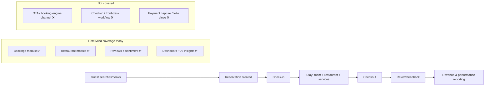
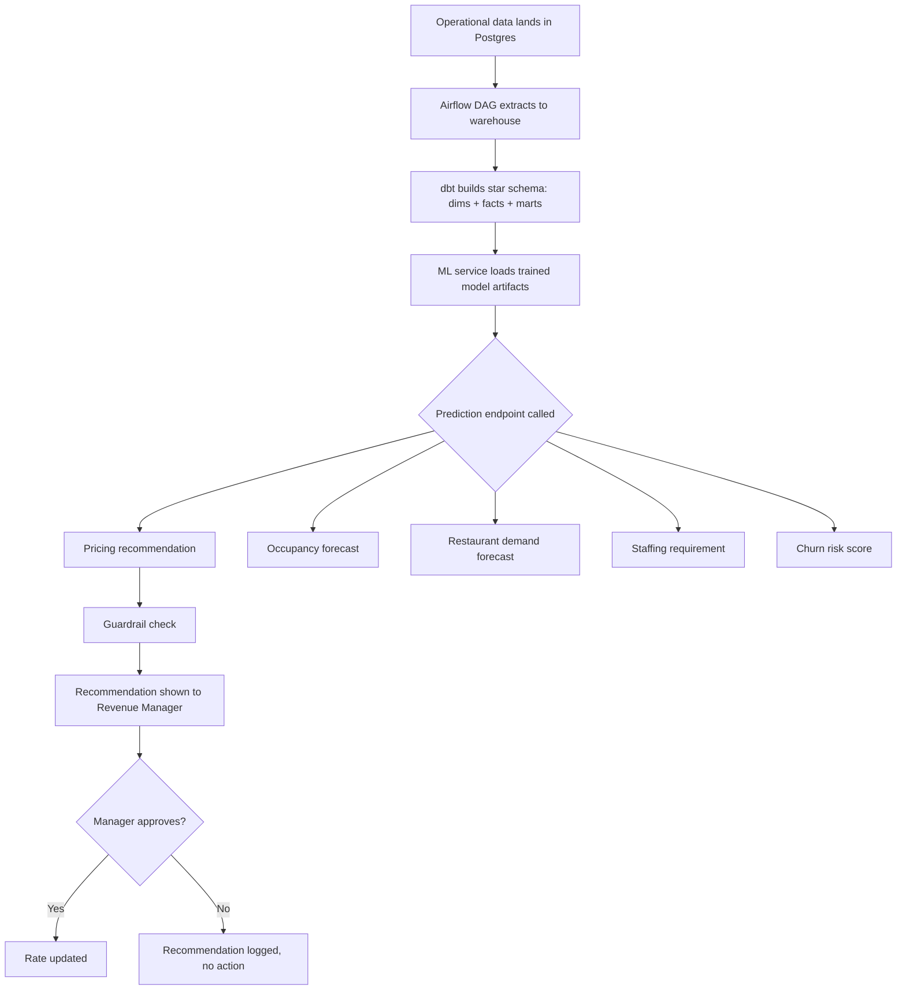
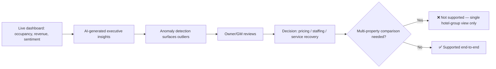

# HotelMind AI — Business Gap Analysis

**Prepared as an enterprise pre-launch evaluation, in the style of a review conducted before pitching to Marriott, Hilton, Hyatt, Accor, IHG, Shangri-La, or Cinnamon Hotels.**

**Reviewer lens:** Senior Product Manager (15+ yrs) / Senior Business Analyst (15+ yrs) / Hospitality Digital Transformation Consultant
**Scope:** Business viability, requirements coverage, and enterprise-readiness only. This document does not evaluate code quality, architecture elegance, or engineering practices.
**Subject:** HotelMind AI — a five-repository system (`hotelmind-backend`, `hotelmind-frontend`, `hotelmind-ml`, `hotelmind-data`, `hotelmind-infra`) currently operated as a single-developer portfolio build, with a live production deployment.

---

## Executive Summary

HotelMind AI is a genuine, working, deployed hotel operations dashboard with real machine learning behind pricing, occupancy, restaurant demand, staffing, and churn — plus a retrieval-augmented "AI assistant" layer. That is a meaningfully rare thing for a portfolio project to actually ship, and it should be credited as such: this is not mockups and wireframes, it is a running system with a Postgres-backed operational schema, an event-driven backend, a trained-model inference layer, and a data warehouse behind it.

It is not, however, a hotel management platform that Marriott's procurement team would take past the first vendor call. Judged against what "hospitality software" means to an enterprise buyer — a category defined by companies like Oracle OPERA, Mews, Cloudbeds, and Infor HMS — HotelMind is missing almost every capability that actually earns a hotel group's trust with revenue and guest data: no payment gateway (the "Payments" module is an internal ledger with no processor behind it), no channel manager or OTA connectivity (a hotel cannot sell a room through HotelMind unless a human types the booking in directly), no POS integration, no multi-tenant account isolation, no audit trail, no role-permission granularity beyond five hardcoded enum values, no compliance posture (GDPR, PCI DSS, SOC 2 are unaddressed), and no loyalty, CRM, or group/banquet functionality of any kind.

The AI layer — the product's actual differentiator — is also weaker in practice than its own documentation claims. Two of five predictive models (restaurant demand, staffing) are trained entirely on synthetic data with no real-world validation. The churn model's reported accuracy is inflated by label leakage, not genuine predictive skill. The generative-AI assistant, the single most demo-able feature, is currently running with its LLM disabled in production due to a documented server-overload incident — it degrades silently to raw document retrieval with no generated answer.

None of this makes HotelMind a bad **engineering** portfolio project — the opposite: it demonstrates unusually broad full-stack and ML delivery capability for a solo build. But this document was commissioned to evaluate it as a **product**, and as a product it is pre-MVP relative to the hospitality-tech category: a strong technology core wrapped around an almost complete absence of the commercial, compliance, and integration infrastructure that hotel groups actually buy. Section 12 scores the *portfolio-demonstration* value of the work (which is higher) separately from the *commercial readiness* of the product (which is low) — conflating the two would be misleading to whoever reads this document to decide anything, whether that's a hiring manager or an investor.

---

## 1. What Problem Does HotelMind Solve?

### 1.1 The stated problem space

Hotel operations today are run across a patchwork of disconnected tools: a PMS (Opera, Cloudbeds) for reservations, a spreadsheet or a separate revenue-management SKU for pricing, a POS for the restaurant, a separate staff-scheduling tool, review monitoring done manually across TripAdvisor/Google/Booking.com, and financial reporting stitched together at month-end by a finance team pulling exports from all of the above. Decisions — "should we drop the room rate this weekend," "do we need an extra server on Friday night," "is this guest at risk of never coming back" — are made on gut feel and lagging indicators, not on live, cross-departmental data.

HotelMind's actual, implemented answer to this is: **a single operational dashboard, with an ML layer underneath it, that gives a hotel's management team live visibility and predictive recommendations across four functional areas — pricing, occupancy, restaurant demand, and staffing — plus a guest-sentiment/churn view and a conversational AI assistant that can answer questions against the hotel's own operational data.**

### 1.2 Industry pain points, and how much of each HotelMind actually addresses

| Problem | Current (industry) process | Pain points | Financial impact | Operational impact | Customer impact | HotelMind coverage |
|---|---|---|---|---|---|---|
| **Revenue leakage from static pricing** | Rates set weekly/manually by a revenue manager using spreadsheets and competitor spot-checks | Reactive, slow to respond to demand shifts, human bias, no continuous optimization | 5–15% of achievable RevPAR left on the table industry-wide (well-documented RM literature) | Revenue manager time consumed by manual analysis instead of strategy | Guests over/under-charged relative to true demand | **Partially solved** — real XGBoost pricing model + guardrails + recommendation history exist and are live |
| **Poor occupancy forecasting** | Manual trend-watching, last year's numbers +/- gut adjustment | No advance warning of demand dips/spikes, over/under-staffing follows | Missed upsell windows, wasted marketing spend timing | Housekeeping/staffing plans built on stale assumptions | Overbooking or empty-room risk | **Partially solved** — Prophet/XGBoost occupancy model exists, but validated against a relative baseline, not real room-inventory ground truth (documented limitation) |
| **Disconnected systems / fragmented reporting** | PMS, POS, HR, and finance systems don't talk to each other; GM assembles a manual report weekly | Data reconciliation errors, delayed decisions, no single source of truth | Analyst/manager hours spent reconciling, not deciding | Decisions made on week-old data | Slow response to guest-facing issues | **Partially solved internally** — HotelMind unifies its *own* modules on one schema, but does not connect to any external PMS/POS/OTA, so it becomes one more disconnected system in a real multi-vendor hotel stack |
| **Food/beverage waste from poor demand prediction** | Kitchen prep quantities based on chef experience and yesterday's numbers | Over-prep = waste, under-prep = stockouts and guest complaints | Food cost is typically 28–35% of restaurant revenue; waste materially erodes margin | Kitchen staff scrambling, inconsistent guest experience | Menu items unavailable, slow service on high-demand days | **Nominally solved** — restaurant demand forecast + prep-list panel exist, but the underlying model is trained on **synthetic data only** — no real predictive validation exists yet |
| **Staff over/under-allocation** | Manual shift scheduling based on manager intuition and historical rosters | Overstaffing on slow days (labor cost), understaffing on peak days (service failure) | Labor is often 25–35% of hotel opex; misallocation is a direct margin hit | Burnout on peak days, idle payroll on slow days | Slow service, guest dissatisfaction on peak periods | **Nominally solved** — staffing requirement model + schedule calendar UI exist, but again trained on **synthetic data**, and the intended optimizer (OR-Tools shift scheduling) is explicitly unimplemented |
| **Guest dissatisfaction / reactive service recovery** | Reviews read manually, days after the fact, complaints handled ad hoc | No early-warning signal, churn-risk guests not proactively identified | Cost of guest acquisition is 5–25x cost of retention (standard hospitality/CRM benchmark) | Front-line staff unaware of at-risk guests in real time | Guests leave without any intervention attempt | **Partially solved** — churn model, sentiment trend, complaints feed, and live alert banner exist, but sentiment scoring is a keyword lexicon (not real NLP) and churn metrics are inflated by label leakage |
| **Lack of predictive, centralized executive visibility** | GM/owner reviews department reports separately, synthesizes manually | Slow, inconsistent, easy to miss cross-departmental correlations | Delayed strategic response to emerging trends | Executive time spent aggregating rather than deciding | Indirect — slower strategic responsiveness | **Solved for a single property/branch group** — real-time dashboard + AI-generated executive insights/anomalies exist, but there's no multi-property or portfolio-level rollup for a chain the size of Marriott |

### 1.3 Honest framing

HotelMind solves a real, well-documented category of hotel operations problems **at the single-property or small-multi-branch level**, and it solves them with genuinely functioning software, not slideware. What it does not solve — and does not yet attempt to solve — is the *systems-integration* problem that is actually the dominant pain point for a hotel group the size of an enterprise buyer: HotelMind is not a PMS, does not talk to a channel manager, does not process payments, and does not replace or integrate with the systems (Opera, a channel manager, a POS, a payment processor) that a Marriott property already runs. It is best understood today as **an analytics-and-recommendation overlay for a single hotel**, not an operations-of-record system.

---

## 2. Why Would Hotels Buy This Product?

### 2.1 Value proposition, as currently substantiated

- **Consolidated visibility**: one login, live dashboard, instead of manually assembling reports from separate tools — genuinely valuable and genuinely built.
- **AI-assisted pricing**: a real trained model recommending rate changes with an explicit guardrail mechanism (a human-in-the-loop safety rail, which enterprise buyers will specifically ask about — see AI Governance in Section 8).
- **Forward-looking operations**: forecasts for occupancy, restaurant demand, and staffing needs, rather than backward-looking reports.
- **Conversational access to operational data**: a RAG-based assistant that lets a manager ask a natural-language question instead of building a report — currently degraded (LLM generation disabled in production) but the retrieval infrastructure is real.
- **Guest sentiment early-warning**: complaints feed, sentiment trend, and churn-risk flags surfaced proactively instead of discovered at checkout or in a bad review weeks later.

### 2.2 Why an enterprise buyer would currently say no

- **No revenue-critical integrations.** A hotel cannot run its actual booking/payment operations through HotelMind. It would have to run HotelMind *alongside* Opera/Cloudbeds/a channel manager/a payment processor, manually keeping data in sync — which defeats the "single source of truth" pitch and adds operational risk rather than removing it.
- **No multi-property governance.** Marriott, Hilton, Hyatt, Accor, IHG, Shangri-La operate hundreds to thousands of properties. HotelMind's data model supports one hotel group with branches; there is no portfolio-of-brands, multi-tenant, or franchise-model structure.
< **No compliance posture.** No documented GDPR data-subject handling, no PCI DSS scope discussion (relevant even without a live gateway, because a "Payments" module touching card-adjacent data will be scoped by any competent security review), no SOC 2 report. Enterprise procurement will not proceed past security review without these.
- **Unvalidated AI claims.** Two of five ML modules run on synthetic training data; this is disclosed honestly in the project's own technical docs, but a buyer doing diligence will find it, and it undermines the core "AI-powered" positioning if surfaced during a pilot.
- **No SLA-grade operational maturity signals**: no visible audit logging, no disaster-recovery/backup documentation, no monitoring/alerting story presented to a business buyer (only Kafka/Redis/WebSocket architecture docs aimed at engineers).

### 2.3 Where it *would* plausibly sell today

A realistic near-term buyer is not a global chain — it's an **independent boutique hotel or small 2–5 property regional group** that currently has no analytics layer at all and is comparing "nothing" to "something," not comparing HotelMind to Opera. In that segment, the honest value proposition is closer to: *"a lightweight ops-intelligence add-on that sits next to your existing PMS,"* not *"replace your hospitality stack."*

---

## 3. Who Are the Users?

Roles are hardcoded in the backend `User` model as an enum: `OWNER`, `REVENUE_MANAGER`, `OPS_MANAGER`, `RESTAURANT_MANAGER`, `GUEST_EXPERIENCE_MANAGER`. This is a real, if narrow, role model — see full stakeholder breakdown in Section 4.

The product is entirely **internal/back-office facing**. There is no guest-facing product surface (no booking widget, no guest portal, no guest mobile app) — guests are a subject of the data (bookings, reviews, churn scores), not a user of the system.

---

## 4. Stakeholder Analysis

| Stakeholder | Goals | Responsibilities | Pain Points (today, without HotelMind) | KPIs they own | Features they'd use in HotelMind | Value received |
|---|---|---|---|---|---|---|
| **Hotel Owner** | Maximize ROI, minimize risk, understand portfolio health at a glance | Capital allocation, strategic oversight | No real-time visibility into performance drivers; relies on lagging monthly reports | RevPAR, GOP margin, ADR, occupancy % | Executive dashboard, AI insights/anomalies, pricing guardrails | Faster, evidence-based strategic decisions — **directly supported today** |
| **CEO / Regional Manager (multi-property)** | Compare performance across properties, allocate investment | Portfolio strategy, cross-property benchmarking | No cross-property rollup exists in most independent tools either | Portfolio RevPAR, cross-property occupancy variance | *None currently* — no multi-property rollup view exists | **Not served today** — largest structural gap for chain buyers |
| **General Manager (GM)** | Run a profitable, well-reviewed property day to day | Coordinates all departments, owns guest experience escalations | Assembling a coherent daily picture from disconnected department tools | Occupancy, guest satisfaction score, staff cost ratio | Full dashboard, guest experience module, staffing view | Strong fit — this is the persona the product is built around |
| **Operations Manager** (`OPS_MANAGER`) | Smooth day-to-day running, refund/exception handling | Approves refunds, oversees cross-department ops | No single view of bookings + staffing + restaurant simultaneously | Operational efficiency, exception resolution time | Bookings, refunds (role-gated), staffing, dashboard | Real fit — role exists in the system with actual authorization logic (refunds gated to OWNER/OPS_MANAGER) |
| **Revenue Manager** (`REVENUE_MANAGER`) | Maximize RevPAR through pricing strategy | Sets/approves rate changes, monitors competitive position | Manual, spreadsheet-driven pricing; slow to react | RevPAR, ADR, rate-change win rate | Pricing recommendation card, guardrail sheet, recommendation history | Strong fit — the most fully-realized workflow in the product |
| **Front Office Manager** | Smooth check-in/out, room assignment | Front desk operations, guest issue first response | Not represented as a distinct role in HotelMind today | Check-in time, walk-in conversion | *No dedicated module* — bookings exist but no front-desk/check-in workflow (no room-status board, no key/PMS-style check-in flow) | **Not served** — a real gap since front office is core to any PMS |
| **Restaurant Manager** (`RESTAURANT_MANAGER`) | Optimize F&B revenue and minimize waste | Manages orders, staffing, prep planning | No demand forecast, manual prep planning | Food cost %, covers/day, waste % | Restaurant demand forecast, prep-list panel | Real fit, but underlying model is synthetic-data-trained — recommendations should be treated as directional, not production-grade, until retrained on real data |
| **Housekeeping Manager** | Room turnaround efficiency, cleanliness standards | Room status tracking, staff assignment | No visibility in current build at all | Rooms cleaned/hour, room-ready SLA | *None* — no housekeeping module exists | **Not served** — a standard PMS module entirely absent |
| **Finance Manager** | Accurate, timely financial reporting; cost control | Reconciliation, invoicing, budget tracking | No real payments/accounting integration to reconcile against | GOP, cost per occupied room | Payments (ledger only) | **Weakly served** — no invoicing, no accounting-system integration, no tax handling |
| **Marketing Manager** | Drive bookings, manage brand reputation | Campaign management, review response | No CRM, no campaign tooling, no loyalty data | Booking conversion, review score trend | Reviews/sentiment view only | **Weakly served** — no CRM, marketing automation, or loyalty module |
| **HR Manager** | Right-size and schedule staff fairly and compliantly | Scheduling, attendance, compliance | Manual scheduling, no labor-law compliance checks | Labor cost %, overtime hours, turnover | Staffing module, schedule calendar, attendance badges | Real fit for scheduling visibility; no compliance/labor-law rule engine |
| **IT Administrator** | System uptime, security, integration management | User provisioning, access control, monitoring | No enterprise IAM, no audit trail to review | Uptime, incident count | *No admin UI evident* — role management appears to be backend-enum-only, no self-service admin console found | **Not served** — no visible admin/IT persona tooling |
| **Guest (leisure/individual)** | Good stay, fair price, smooth service | N/A — subject of the system, not a user | N/A | N/A | Indirect beneficiary of pricing/service improvements | No direct guest-facing surface exists |
| **Corporate Guest / Travel Agency** | Negotiated rates, reliable group booking | N/A | No corporate-rate or contract-rate structures found in the data model | N/A | None | **Not served** — no corporate contract/rate-plan concept implemented |
| **OTA (Booking.com, Expedia, etc.)** | Two-way inventory/rate sync | N/A | HotelMind has no channel manager | N/A | None | **Not served** — zero OTA connectivity |
| **Maintenance Team** | Timely repair, asset uptime | Work order handling | No maintenance/ticketing module in HotelMind | Ticket resolution time | None | **Not served** |
| **Data Analyst** | Reliable, queryable data for reporting | Builds reports/dashboards from the warehouse | This role is unusually well served — real dbt star schema exists | Data freshness, pipeline reliability | Data warehouse (Airflow/dbt), marts | Strong fit — genuinely one of the most mature parts of the system |
| **AI/ML Administrator** | Model performance, retraining, governance | Monitors model drift, retrains on new data | No MLOps dashboard exposed to a business user; Phase 6 (MLOps) incomplete | Model accuracy, drift rate | ML API docs only (technical, not business-facing) | **Not served as a business persona** — governance is not exposed anywhere at the product layer |

---

## 5. Business Process Mapping

### 5.1 Guest lifecycle — As-Is vs. HotelMind



**As-Is (industry norm):** Guest books via OTA or direct site → PMS creates reservation → front desk checks guest in against the PMS → charges accrue to a folio across room/restaurant/services → payment captured at checkout → review requested → performance rolled into monthly reporting.

**Problems:** Manual re-keying between OTA/PMS/POS, no live cross-department visibility, reporting lags the actual stay by weeks.

**To-Be (HotelMind's actual reach):** Bookings, restaurant orders, and reviews are captured in one schema and reflected on a live dashboard immediately; an AI assistant can be asked about it in natural language.

**Gap:** HotelMind currently has no functional presence at the *booking-channel*, *check-in*, or *payment-capture* stages — the three highest-friction, highest-financial-risk stages of the lifecycle. It picks the process up mid-stream (reservation already exists) and drops it before money actually changes hands.

**Business value where present:** Real — a GM gets live cross-departmental visibility they don't otherwise have. **Business value where absent:** These gaps are disqualifying for any buyer evaluating HotelMind as a PMS replacement, though not disqualifying for it being sold as a lightweight overlay next to an existing PMS.

### 5.2 AI Prediction Workflow



**As-Is (industry norm without an ML layer):** Revenue manager reviews comp-set data and gut-checks a rate change weekly.

**Problems:** Slow, inconsistent, not continuously optimized, no systematic learning loop.

**To-Be (HotelMind):** A model-driven recommendation with an explicit human-approval guardrail — this is a legitimate, enterprise-credible pattern (human-in-the-loop AI, not full autonomy), and it is genuinely implemented.

**HotelMind Solution / Business Value:** This is the single most enterprise-ready workflow in the product. The guardrail concept specifically should be highlighted to buyers, since "will the AI unilaterally change prices" is a first-meeting objection every AI-pricing vendor faces.

**Caveat to flag honestly:** the workflow is only as trustworthy as the training data behind each model — real for pricing/occupancy, synthetic for restaurant/staffing (Section 1.2), and label-leakage-compromised for churn.

### 5.3 Executive Decision Workflow



**Business value:** For a single property or small branch group, this closes the loop from data to decision faster than manual report assembly. **Gap:** the moment a decision requires comparing performance *across* independently-managed properties (the normal reality for any enterprise buyer), the workflow has no supported path.

---

## 6. Business Requirements

### 6.1 Functional Requirements (as implied by what's built — reverse-engineered BA documentation)

| ID | Requirement | Status |
|---|---|---|
| FR-01 | System shall allow role-based login (Owner, Revenue Manager, Ops Manager, Restaurant Manager, Guest Experience Manager) | ✅ Implemented |
| FR-02 | System shall support a multi-branch hotel hierarchy (Hotel → Branch → Floor → Room Type → Room) | ✅ Implemented |
| FR-03 | System shall manage bookings against rooms | ✅ Implemented |
| FR-04 | System shall recommend room rates using a predictive model, subject to a guardrail before activation | ✅ Implemented |
| FR-05 | System shall forecast occupancy | ✅ Implemented (data-quality caveat) |
| FR-06 | System shall forecast restaurant demand and support prep planning | ✅ Implemented (synthetic training data) |
| FR-07 | System shall recommend staffing requirements and support scheduling | ✅ Implemented (synthetic training data) |
| FR-08 | System shall score guest churn risk and surface interventions | ⚠️ Implemented but metrics unreliable (label leakage) |
| FR-09 | System shall ingest and analyze guest reviews for sentiment/topics | ⚠️ Implemented via keyword lexicon, not true NLP |
| FR-10 | System shall provide a conversational assistant answering questions against hotel data (RAG) | ⚠️ Implemented; LLM generation currently disabled in production |
| FR-11 | System shall record payments against bookings | ⚠️ Ledger only — no external payment processor |
| FR-12 | System shall push live updates to the dashboard without manual refresh | ✅ Implemented (Kafka/Redis/WebSocket) |
| FR-13 | System shall connect to OTAs/channel managers for inventory and rate sync | ❌ Not implemented |
| FR-14 | System shall integrate with a POS system | ❌ Not implemented |
| FR-15 | System shall support guest check-in/check-out front-desk workflows | ❌ Not implemented |
| FR-16 | System shall support housekeeping room-status tracking | ❌ Not implemented |
| FR-17 | System shall support maintenance ticketing | ❌ Not implemented |
| FR-18 | System shall support group/corporate rate plans and contracts | ❌ Not implemented |
| FR-19 | System shall support loyalty programs | ❌ Not implemented |
| FR-20 | System shall provide portfolio-level (multi-property) reporting | ❌ Not implemented |

### 6.2 Non-Functional Requirements

| Category | Requirement | Status |
|---|---|---|
| Availability | System should target enterprise SLA (e.g., 99.9%) | ❌ No SLA defined or monitored at product level |
| Security | Role-based access control | ✅ Implemented (coarse: 5 fixed roles) |
| Security | Audit logging of sensitive actions (refunds, rate overrides) | ❌ Not implemented |
| Security | Data encryption at rest/in transit | ⚠️ Not documented as a business commitment |
| Compliance | GDPR data-subject rights (access, erasure) | ❌ Not addressed |
| Compliance | PCI DSS scope (if handling any card-adjacent data) | ❌ Not addressed |
| Compliance | SOC 2 / equivalent attestation | ❌ Not addressed |
| Scalability | Multi-tenant isolation for SaaS delivery to unrelated hotel groups | ❌ Not implemented (single-tenant, multi-branch only) |
| Localization | Multi-currency, multi-language, tax localization | ❌ Not implemented |
| Disaster Recovery | Documented backup/restore and DR plan (business-facing) | ❌ Not documented at product level |
| AI Governance | Human-in-the-loop control over AI-driven pricing changes | ✅ Implemented (guardrail mechanism) |
| AI Governance | Model explainability / confidence disclosure to end users | ⚠️ Not evident in UI |

### 6.3 Business Rules (observed)

- Refunds may only be approved by OWNER or OPS_MANAGER roles.
- Pricing changes generated by the AI model require a guardrail check before taking effect (human approval gate).
- Users are scoped to a single branch except OWNER, who has cross-branch visibility within one hotel group.

### 6.4 Assumptions

- The buyer operates (or intends to operate) a single hotel group with multiple branches, not a multi-brand portfolio.
- The buyer is willing to run HotelMind alongside an existing PMS/channel manager/payment processor rather than replacing them, at least in a pilot phase.
- Real operational data (bookings, restaurant sales, staffing records) will eventually replace the synthetic data currently backing two ML modules.

### 6.5 Dependencies

- ML predictions depend on the data warehouse pipeline (Airflow/dbt) running reliably and on schedule.
- The AI assistant depends on an LLM provider being enabled (currently disabled in production per operational incident).
- Real-time dashboard depends on Kafka/Redis infrastructure remaining available.

### 6.6 Constraints

- No integration budget/timeline has been established for OTA, POS, or payment-gateway connectivity.
- Current role model (5 hardcoded enum roles) constrains customer-specific org structures.

### 6.7 Acceptance Criteria (sample, for the pricing workflow — as a BA would document it)

- Given a Revenue Manager is logged in, when a pricing recommendation is generated, then it must be held behind a guardrail and require explicit approval before the live rate changes.
- Given a rate change is approved, then it must be logged with the approving user and timestamp (**currently unverified whether this audit record persists — flagged as a gap, see Section 8**).

### 6.8 KPIs

| Category | KPI | Currently Measurable in HotelMind? |
|---|---|---|
| Business | RevPAR, ADR, Occupancy % | ✅ Yes |
| Business | GOP margin | ❌ No (no cost/accounting integration) |
| Operational | Room turnaround time | ❌ No (no housekeeping module) |
| Operational | Staff cost ratio | ⚠️ Partial (staffing data exists, no payroll integration) |
| AI | Model accuracy / drift | ⚠️ Tracked internally in ML repo, not exposed to business users |
| AI | Recommendation acceptance rate | ⚠️ Recommendation history exists; explicit acceptance-rate KPI not confirmed as surfaced |
| Revenue | Rate-change win rate (did accepted recommendations outperform) | ❌ Not implemented as a tracked outcome metric |
| Guest | Churn-risk intervention success rate | ❌ Not tracked as a closed-loop outcome |

---

## 7. Capability Mapping Matrix

| Capability | Current Status | Business Importance | Current Implementation | Missing Pieces | Priority |
|---|---|---|---|---|---|
| Reservation Management | Partial | Critical | Core booking CRUD against rooms | No OTA sync, no group bookings, no check-in workflow | P0 |
| Dynamic Pricing | Strong | Critical | XGBoost model + guardrail + history | Retraining loop, outcome tracking (win rate) | P1 |
| Occupancy Forecasting | Moderate | Critical | Prophet/XGBoost model | Real inventory-based ground truth | P1 |
| Restaurant Demand Forecasting | Weak (data quality) | High | XGBoost per meal period + prep list UI | Real transactional training data | P1 |
| Staff Optimization | Weak (data quality) | High | Regression model + schedule calendar | Real attendance/labor data, actual shift optimizer (OR-Tools scaffold unbuilt) | P1 |
| Guest Sentiment / Churn | Weak (model validity) | High | Sentiment feed, churn model, alert banner | Real NLP sentiment model, leakage-free churn model | P1 |
| AI Assistant (RAG) | Degraded in production | High (flagship feature) | FAISS+BM25 retrieval, pluggable LLM | LLM currently disabled; needs resilient hosting/cost model | P0 |
| Executive Dashboard | Strong (single property) | Critical | Real-time WebSocket dashboard, AI insights/anomalies | Multi-property/portfolio rollup | P0 (for enterprise) |
| Data Warehouse | Strong | High (enabling capability) | Airflow + dbt star schema | Business-facing data governance docs | P2 |
| Role Permissions | Weak | Critical for enterprise | 5 hardcoded roles, endpoint-level gating | Granular/custom permission sets, no admin UI | P0 |
| Audit Logs | Absent | Critical for enterprise | None found | Full audit trail for pricing/refunds/access | P0 |
| Multi-Property/Multi-Tenant | Absent | Critical for enterprise | Multi-branch only, single tenant | True multi-tenant SaaS isolation, portfolio views | P0 |
| Channel Manager / OTA | Absent | Critical for any hotel | None | Full build required | P0 |
| POS Integration | Absent | High | None (first-party restaurant module only) | Integration layer | P1 |
| Payment Gateway | Absent | Critical | Internal ledger model only | Real processor integration (Stripe/Adyen/etc.), PCI scoping | P0 |
| CRM / Loyalty | Absent | High | None | Full build required | P1 |
| Compliance (GDPR/PCI/SOC2) | Absent | Critical for enterprise | None | Full compliance program | P0 |
| Security (SSO/MFA) | Absent | Critical for enterprise | JWT auth only | SSO, MFA, session policy | P0 |
| Cloud/DR Posture | Undocumented (business-facing) | Critical for enterprise | Single VM deployment (Contabo) per incident doc | Documented HA/DR architecture, business-facing SLA | P0 |
| Digital Twin / advanced simulation | Absent | Low near-term, high long-term differentiation | None | Not started — genuinely future-facing, not urgent | P3 |

---

## 8. Gap Analysis — HotelMind vs. Real Enterprise Hospitality Platforms

Benchmarked conceptually against Oracle OPERA PMS, Cloudbeds, Mews, Infor HMS, Protel, Apaleo, and StayNTouch — the category HotelMind would be compared against in any enterprise RFP.

| Capability Area | Enterprise PMS Standard | HotelMind Today | Gap Severity |
|---|---|---|---|
| Role permissions | Granular, custom permission sets per property/department | 5 fixed enum roles | **Severe** |
| Audit logs | Full action-level audit trail, exportable for compliance | None found | **Severe** |
| Multi-property support | Native portfolio/brand hierarchy, cross-property reporting | Single hotel-group, multi-branch only | **Severe** |
| Channel Manager | Two-way OTA rate/inventory sync (Booking.com, Expedia, Airbnb, GDS) | None | **Severe** |
| OTA integrations | Native or via channel manager | None | **Severe** |
| POS integrations | Native/partner integrations (Micros, Toast, Square, etc.) | First-party restaurant module only, no external integration | **High** |
| Payment Gateway | PCI-compliant processor integration (Stripe, Adyen, etc.) | Internal ledger, no processor | **Severe** |
| Invoice Management | Automated guest/corporate invoicing | None | **High** |
| Accounting integration | GL export, integration with Xero/QuickBooks/SAP | None | **High** |
| Procurement / Vendor Management | Purchase orders, vendor catalogs | None | **Medium** (less core to hospitality-tech buying decision) |
| Maintenance / Asset Management | Ticketing, preventive maintenance schedules | None | **Medium-High** |
| CRM | Guest profile history across stays, preference tracking | Reviews only; no persistent guest CRM profile | **High** |
| Marketing Automation | Campaign tooling, segmentation | None | **Medium** |
| Loyalty | Points/tier programs | None | **High** |
| Guest Profiles | Persistent, cross-stay guest identity and preferences | Not evident as a first-class entity | **High** |
| Rate Plans / Corporate Contracts | Negotiated corporate/agency rate structures | None | **High** |
| Group Bookings / Conference / Banquet | Block booking, event/banquet management | None | **Medium-High** |
| Spa / Gym / Laundry ancillary modules | Standard in full-service PMS suites | None | **Low-Medium** (nice-to-have, not category-defining) |
| Housekeeping (incl. mobile app) | Room status board, mobile task assignment | None | **Severe** (core PMS function, entirely absent) |
| Notification Center | Cross-role, configurable alerts | Only a live-alert banner in guest experience module | **Medium** |
| Workflow / Approvals engine | Configurable multi-step approvals | Only the pricing guardrail (single-purpose) | **Medium-High** |
| Document Management | Contracts, compliance docs, guest ID storage | None | **Medium** |
| Localization (currency/tax/language) | Multi-currency, multi-language, tax-jurisdiction-aware | None evident | **Severe** for global chains |
| Accessibility | WCAG-compliant UI | Not assessed/documented | **Unknown — needs audit** |
| Offline mode | Front-desk operations continue during outages | None (real-time-dependent architecture) | **Medium-High** |
| API Marketplace / Open API | Partner ecosystem, documented public API | Internal API only, not a partner platform | **Medium** |
| Data Governance / Master Data | Formal data ownership, lineage, stewardship | Warehouse exists technically; no business-facing governance program | **Medium** |
| Identity Management | Enterprise IAM/SSO/SCIM | JWT-only, no SSO | **Severe** |
| Disaster Recovery / Backup | Documented, tested DR plan with RTO/RPO | Single-VM deployment, no business-facing DR documentation | **Severe** |
| Monitoring (business-facing) | Uptime dashboards, incident communication | Technical monitoring only (Grafana/Prometheus for engineers) | **Medium** |
| AI Governance / Model Explainability | Documented model risk management, explainability for regulated decisions (pricing) | Guardrail exists; no explainability, no model risk documentation | **High** |
| Human approval workflows (beyond pricing) | Approvals across refunds, rate overrides, etc. | Only pricing has a guardrail | **Medium** |
| Data Privacy / GDPR | Data subject rights, consent management, DPA-ready | Not addressed | **Severe** for EU-operating chains |
| PCI DSS | Required if any card data is touched | Not addressed; currently avoided only because no processor exists yet | **Severe** once payments are added |
| SOC 2 / equivalent | Standard procurement gate for enterprise SaaS | Not pursued | **Severe** for enterprise sales |

**Bottom line:** Of roughly 34 capability areas benchmarked, HotelMind has strong or complete coverage in fewer than 5 (pricing AI, real-time dashboard, data warehouse, staffing/restaurant UI shells, sentiment feed UI), partial coverage in a handful, and is entirely absent in the majority — including nearly everything that defines the *procurement* conversation for an enterprise hotel group (security, compliance, integrations, multi-property governance).

---

## 9. Business Value Matrix

| Feature | Business Value | Revenue Impact | Cost Reduction | Customer Satisfaction | Operational Efficiency | Competitive Advantage | Priority |
|---|---|---|---|---|---|---|---|
| Dynamic Pricing (AI) | High | High | Low | Neutral | Medium | High (if real-data validated) | P1 |
| Occupancy Forecasting | Medium-High | Medium | Low | Neutral | Medium | Medium | P1 |
| Real-time Executive Dashboard | High | Indirect | Medium | Neutral | High | Medium | P0 |
| AI Assistant (RAG) | Medium (currently degraded) | Indirect | Medium | Low direct | Medium | High (once fixed) | P0 |
| Restaurant Demand Forecast | Medium | Low-Medium | Medium (waste reduction) | Medium | Medium | Low (until real data) | P1 |
| Staffing Optimization | Medium | Low | Medium-High | Medium | High | Low (until real data) | P1 |
| Guest Sentiment / Churn | Medium | Medium (retention) | Low | High | Medium | Medium (once real NLP) | P1 |
| Payment Gateway (missing) | Critical (blocking) | High | N/A | High | High | High | P0 |
| Channel Manager / OTA (missing) | Critical (blocking) | Very High | N/A | Medium | High | Very High | P0 |
| Multi-property Reporting (missing) | Critical for enterprise (blocking) | High | Medium | Low | High | High | P0 |
| Loyalty / CRM (missing) | High | High | Low | High | Medium | High | P1 |
| Compliance Program (missing) | Critical (blocking sale entirely) | N/A | N/A | Low direct | N/A | N/A (table stakes) | P0 |

---

## 10. Risk Analysis

| Risk Category | Risk | Likelihood | Impact | Mitigation |
|---|---|---|---|---|
| Business | Product is pitched as "AI hospitality platform" but cannot process a real booking end-to-end | High | Severe (credibility) | Reposition as an ops-intelligence overlay until PMS/OTA/payment gaps close |
| Operational | Restaurant/staffing recommendations based on synthetic data are trusted operationally | Medium | High (bad decisions, waste/labor cost) | Clearly label these modules "beta/simulated" until retrained on real data |
| Technical | Single-VM production deployment with no documented DR | Medium | High (extended outage risk) | Document and test a DR/backup plan; move toward HA architecture before any enterprise pilot |
| AI | Churn model metrics inflated by label leakage, may be relied on for real interventions | Medium | High (wasted retention spend, missed real churn) | Rebuild feature set to eliminate leakage; validate on held-out real-world outcomes |
| AI | LLM assistant silently degrades to raw retrieval with no warning to the user | High (already occurred in production) | Medium-High (trust erosion) | Add explicit UI state for "AI generation unavailable" instead of silent fallback |
| Financial | No payment gateway means no path to transaction-based revenue capture within the product | High | High (limits monetization model) | Scope and prioritize a real gateway integration |
| Legal/Compliance | No GDPR/PCI/SOC2 posture; any pilot with an EU or enterprise customer risks non-compliance | High if pursuing enterprise now | Severe | Do not pursue enterprise deals until a compliance program exists; start with SOC 2 readiness and a documented data-privacy policy |
| Security | No SSO/MFA, no audit logs | High | High for enterprise procurement | Prioritize P0 identity/audit items before any enterprise sales motion |
| Adoption | Hotel staff must adopt a new tool alongside their existing PMS rather than instead of it, raising friction | Medium | Medium | Be explicit in go-to-market that this is a companion tool in the near term, not a replacement |

---

## 11. Roadmap

```mermaid
gantt
    title HotelMind AI — Realistic Product Roadmap
    dateFormat  YYYY-MM
    axisFormat  %Y-%m

    section Already Built (MVP)
    Core ops dashboard, bookings, pricing AI, forecasting, RAG assistant :done, mvp, 2025-01, 2026-08

    section V1 - Trust & Data Integrity
    Retrain restaurant/staffing on real data      :v1a, 2026-09, 3M
    Fix churn model leakage, validate real accuracy :v1b, 2026-09, 2M
    Re-enable LLM assistant with resilient hosting :v1c, 2026-09, 2M
    Basic audit logging                            :v1d, 2026-10, 2M

    section V2 - Enterprise Table Stakes
    SSO / MFA / granular roles                     :v2a, 2026-12, 3M
    Payment gateway integration                    :v2b, 2027-01, 3M
    GDPR + SOC2 readiness program                  :v2c, 2027-01, 4M

    section V3 - Systems Integration
    Channel manager / OTA connectivity              :v3a, 2027-04, 4M
    POS integration                                 :v3b, 2027-05, 3M
    Housekeeping & maintenance modules              :v3c, 2027-05, 3M

    section Enterprise Edition
    Multi-property / portfolio rollup               :ee1, 2027-09, 4M
    CRM + Loyalty                                   :ee2, 2027-10, 4M
    Group/Conference/Banquet management              :ee3, 2028-01, 3M

    section AI Expansion
    Explainable AI, model risk documentation         :ai1, 2027-06, 3M
    Digital twin simulation (long-horizon)           :ai2, 2028-06, 6M

    section Global Expansion
    Localization: currency, tax, language            :ge1, 2028-01, 4M
```

**Interpretation for leadership:** everything before "Enterprise Table Stakes" is necessary just to make the existing AI claims trustworthy. Everything in "Enterprise Table Stakes" and "Systems Integration" is necessary before any conversation with a chain like Marriott is realistic. "Enterprise Edition" is the actual point at which HotelMind becomes comparable to Mews or Cloudbeds. That is a multi-year build for a well-resourced team, not a next-sprint gap.

---

## 12. Portfolio Evaluation

Scored on two separate axes, because they answer different questions: **(a) what does this demonstrate about the builder's PM/BA/technical-product skill**, and **(b) how commercially ready is the product**. Conflating them would overstate the product's readiness or understate the builder's capability — neither is accurate.

| Lens | Score (1-10) | Rationale |
|---|---|---|
| **Senior Product Manager** | 6/10 | Demonstrates real product instinct: guardrails on AI pricing, role-scoped permissions, a coherent feature set aimed at a specific persona (GM/ops team). Missing: no PRD, no prioritization framework, no evidence of user research, no articulated business model or pricing strategy, no GTM thinking anywhere in the repo. |
| **Business Analyst** | 4/10 | Zero formal BA artifacts exist (no requirements docs, no process maps, no traceability matrix) prior to this document. The *system* implies reasonable business logic (role gating, guardrails, branch scoping), but that logic was never captured as requirements — it was inferred by reverse-engineering the code, which is not how a BA operates in practice. |
| **AI Product Manager** | 6.5/10 | Strong: pluggable LLM provider abstraction, RAG architecture, human-in-the-loop guardrail on the highest-risk AI decision (pricing). Weak: no model card discipline visible to a business stakeholder, no explainability, unresolved label leakage went undetected by product-level QA (though caught and disclosed honestly in engineering docs — a genuinely good sign of intellectual honesty), no incident communicated as a *product* risk (only as an ops log). |
| **Technical Product Manager** | 7/10 | The event-driven architecture (Kafka/Redis/WebSocket), the data warehouse, and the multi-service system design reflect real technical-product judgment — most solo builders don't attempt this scope. Weak: no visible tradeoff documentation (why Kafka vs. simpler polling, why this warehouse pattern) framed for a business audience. |
| **Solution Consultant** | 3/10 | No competitive positioning, no discovery/qualification framework, no implementation methodology, no customer-facing collateral of any kind exists. This is the weakest lens — solution consulting is fundamentally about translating product capability into a customer's specific context, and nothing in the repo does that. |
| **Digital Transformation Consultant** | 4/10 | The product correctly identifies real hospitality pain points (Section 1), which shows domain awareness. But a transformation consultant's job is change management, stakeholder alignment, and phased adoption planning — none of which exists here. The product was built end-to-end by one person without an apparent customer discovery loop. |

### What demonstrates PM skill
- Guardrail-gated AI pricing (shows awareness that unchecked AI decisions are a trust/liability risk)
- Role-based feature gating tied to actual job functions (refunds restricted appropriately)
- A coherent, prioritizable feature set rather than a disconnected pile of demos

### What demonstrates BA skill
- The underlying data model (Hotel→Branch→Floor→RoomType→Room, five distinct operational roles) reflects real domain modeling
- Business rules are enforced in code (refund authorization, guardrails) — evidence of process thinking, even if never documented as such

### What's missing for a strong portfolio
- Every artifact listed in Section 13, without exception — there is currently a 100% gap in market-facing and requirements-facing documentation
- Any evidence of talking to a real hotel operator, GM, or revenue manager during design
- A defined business model (SaaS pricing, per-property fee, revenue share on RevPAR lift — none stated anywhere)
- Explicit acknowledgment, in a business document (not just an engineering "known limitations" file), of which AI claims are production-grade vs. simulated

### Verdict
As an **engineering portfolio**, this is unusually strong — broad, real, deployed. As a **PM/BA portfolio**, it is currently a technology showcase with no business-artifact layer around it, and that is precisely the gap this document — and the fourteen recommended documents in Section 13 — exists to close.

---

## 13. Recommended Additional Portfolio Documents

To convert this from an engineering showcase into a credible PM/BA portfolio, produce the following (roughly in priority order):

| Priority | Document | Purpose |
|---|---|---|
| 1 | **Product Requirements Document (PRD)** | Defines what should be built and why, forward-looking — the single most-missing artifact |
| 1 | **Business Requirements Document (BRD)** | Captures business rules/process requirements formally (this document's Section 6 is a starting seed, not a substitute) |
| 1 | **User Personas** | Formalizes Section 4's stakeholders into named, motivated personas |
| 1 | **Competitive Analysis** | Direct comparison vs. Opera/Mews/Cloudbeds/Apaleo — positions HotelMind honestly in the market |
| 2 | **Customer Journey Map** | Visualizes the guest and staff journeys end-to-end, including the gaps identified in Section 5 |
| 2 | **Use Cases / Use Case Specifications** | Formal scenario documentation for core workflows (pricing approval, churn intervention, etc.) |
| 2 | **User Stories / Epic Breakdown** | Translates the roadmap (Section 11) into buildable backlog items |
| 2 | **Business Case / ROI Analysis** | Quantifies expected value (RevPAR lift, labor savings) with assumptions stated explicitly |
| 2 | **Risk Register** | Living version of Section 10, tracked and updated over time |
| 3 | **Stakeholder Matrix** (power/interest grid) | Formalizes Section 4 for a real deployment/change-management context |
| 3 | **Market Research** | External validation of hospitality-tech buyer needs and budget realities |
| 3 | **Requirements Traceability Matrix (RTM)** | Links requirements → design → test, standard BA deliverable |
| 3 | **Decision Log** | Captures key product decisions and their rationale over time |
| 3 | **Feature Prioritization Framework** (e.g., RICE/MoSCoW applied to Section 7's matrix) | Shows structured prioritization reasoning, not just a list |
| 4 | **OKRs / KPI Framework** | Connects product work to measurable business outcomes |
| 4 | **Data Dictionary / Glossary** | Business-facing definitions of RevPAR, ADR, GOP, etc. and how HotelMind's fields map to them |
| 4 | **AI Governance Document** | Model risk, explainability policy, human-in-the-loop standards — directly addresses Section 8's most severe AI-related gap |
| 4 | **Go-to-Market Strategy** | Who buys this first (Section 2.3's boutique/small-group thesis, formalized) |
| 4 | **Pricing Strategy** | Per-property, per-room, or outcome-based (RevPAR-share) pricing model |
| 5 | **Release Plan** | Maps the roadmap to concrete, sequenced releases with scope per release |
| 5 | **Implementation / Change Management Plan** | How a hotel actually onboards onto HotelMind alongside its existing PMS |
| 5 | **Training Guide** | Enablement material for the five defined user roles |
| 5 | **Support Model** | SLA tiers, escalation paths — currently entirely undefined |

---

## Closing Assessment

HotelMind AI is a legitimate demonstration of full-stack and applied-ML delivery capability, and the engineering-side honesty in its own documentation (disclosing synthetic training data, disclosing the label-leakage issue, disclosing the production LLM outage) is a genuinely good signal about the builder's integrity — that kind of self-disclosure is rare and should not be undervalued. But judged strictly as a **business proposition for hotel groups like Marriott, Hilton, Hyatt, Accor, IHG, Shangri-La, or Cinnamon Hotels**, it is pre-revenue-readiness: it cannot process a real booking end-to-end, cannot take a payment, cannot connect to a single OTA, has no compliance posture, and has no multi-property governance model. The path forward is not more AI features — it is the unglamorous, table-stakes integration and compliance work in Sections 8 and 11, without which no enterprise procurement conversation will proceed past the first security questionnaire.
